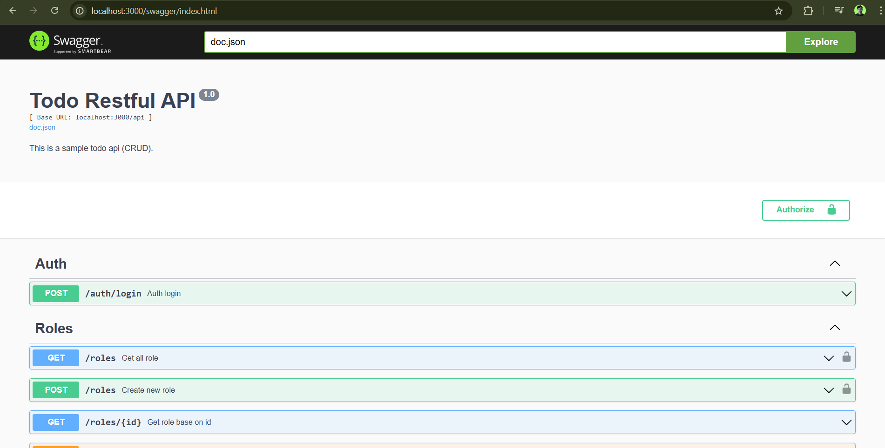

# Todo RESTful API - Golang
A simple yet production-ready RESTful API built with **Golang**, **HttpRouter**, **MySQL**, and **JWT authentication**.  
The project includes automatic database migrations and Swagger-powered API documentation.

## 🚀 Tech Stack

| Layer          | Technology |
|----------------|------------|
| Language       | Go 1.22 +  |
| Router         | [HttpRouter](https://github.com/julienschmidt/httprouter) |
| Database       | MySQL 8 +  |
| Migrations     | [golang-migrate](https://github.com/golang-migrate/migrate) |
| Auth           | JWT (HMAC SHA-256) |
| Docs           | [swaggo/swag](https://github.com/swaggo/swag) (Swagger UI) |

---

## 📦 Features

- **Role, User, Todo** full CRUD
- Role-based access control
- Centralized middleware: JWT auth
- MySQL migrations (`migrate up/down`)
- Swagger UI with live “Authorize” form

---

## 🔐 JWT Authenticate

```Authorization: Bearer <token>```

---

## 🚀 Endpoint list API
You can access **/swagger** at your route to see all existing endpoints.



---


MIT License.  
Please feel free to use for personal and commercial purposes.

